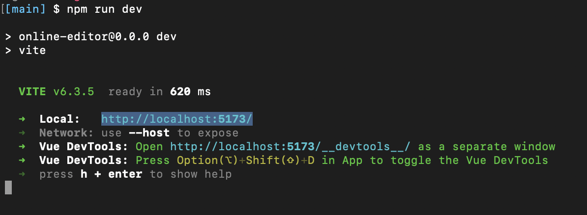
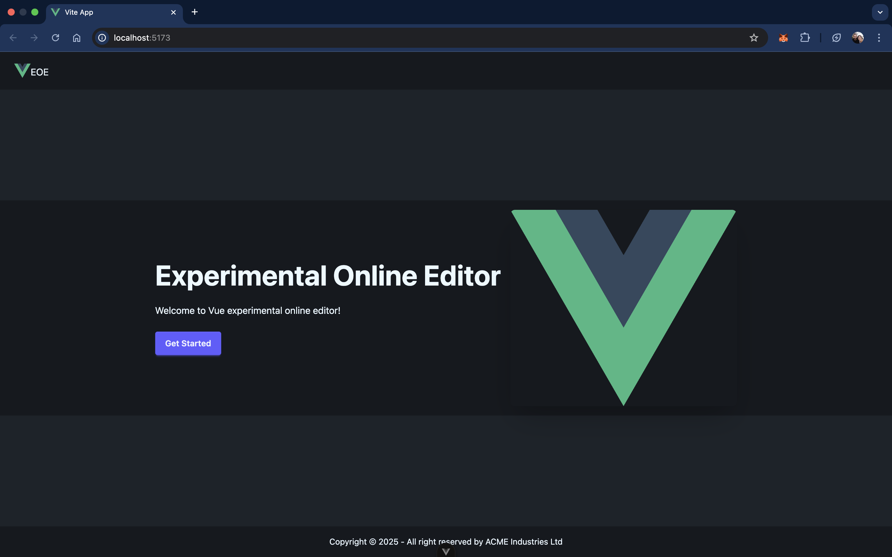
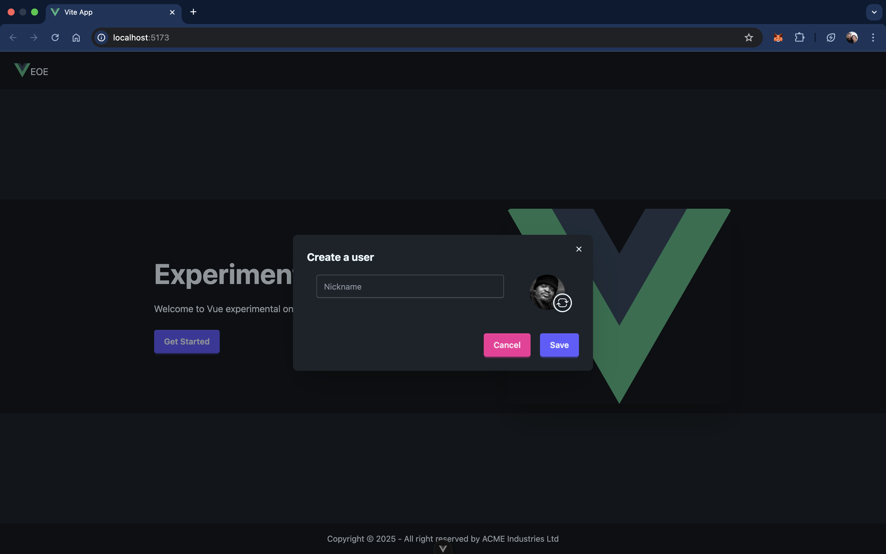
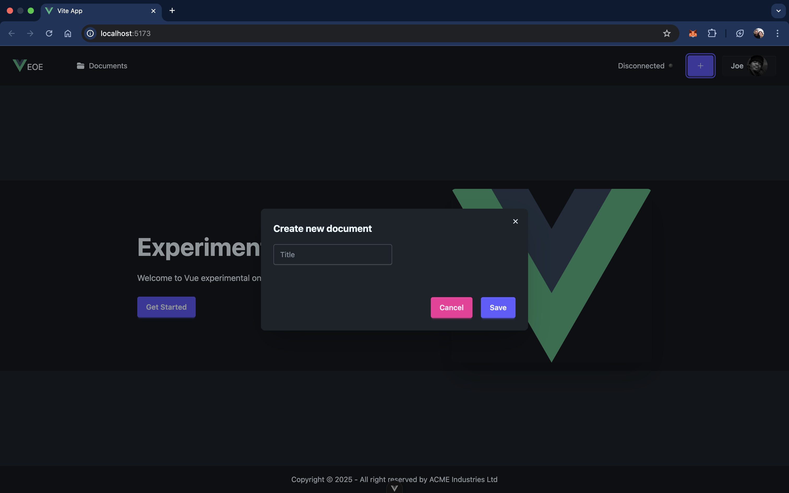
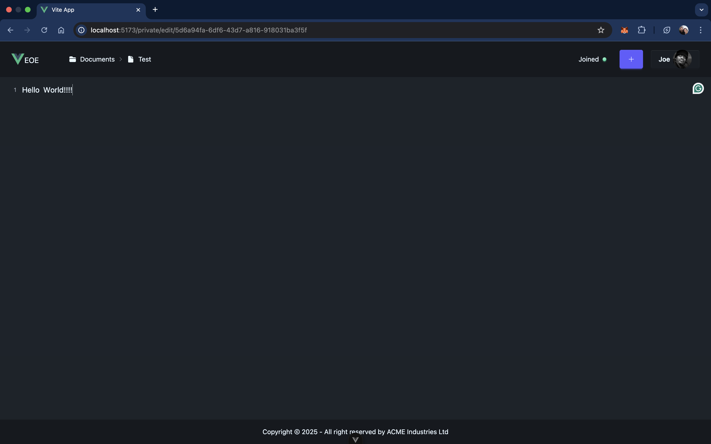
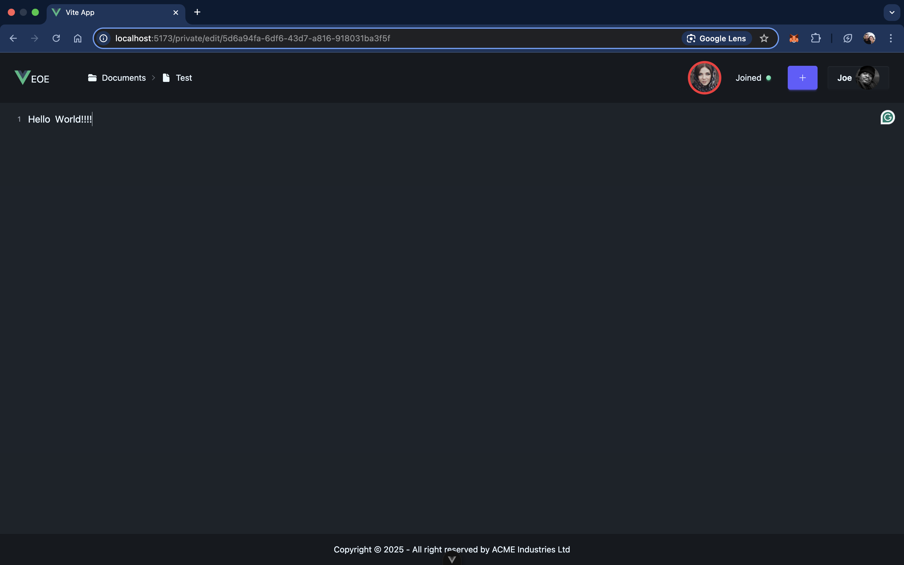
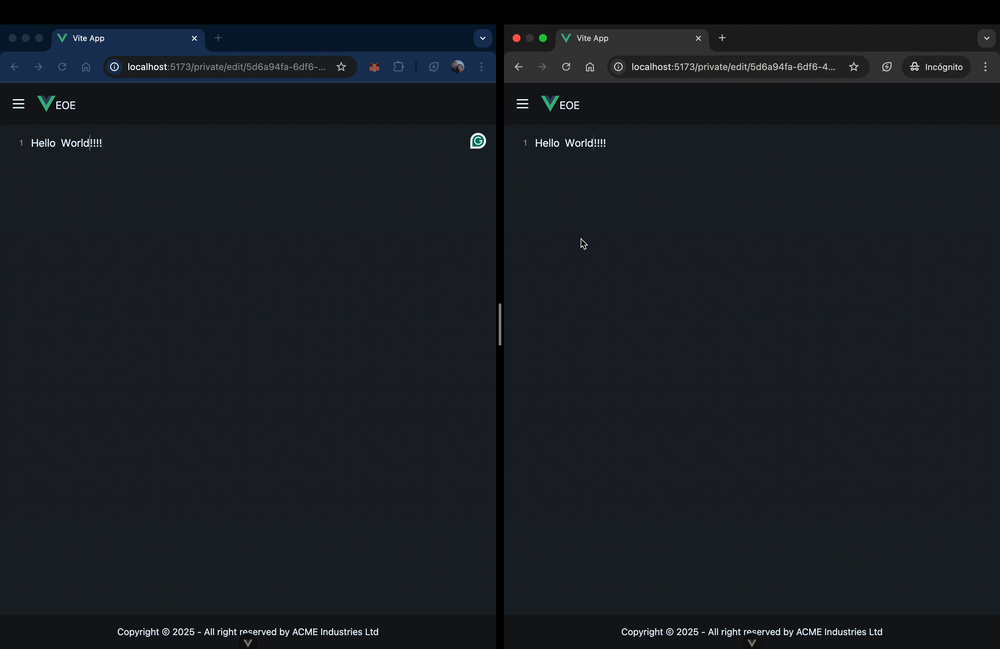

# online-editor

This is the backend part of Vue Experimental Online Editor (VEOE)

This is just a training project, so it's not complete

## Installing

### Backend

```
git clone https://github.com/agmoyano/vue-online-editor-backend.git
cd vue-online-editor-backend
npm install
```

### Frontend

```
git clone https://github.com/agmoyano/vue-online-editor.git
cd vue-online-editor
npm install
```

## Running

You need both backend and frontend running at the same time.

### Backend

```
vue-online-editor-backend $ npm run dev
```

### Frontend

```
vue-online-editor $ npm run dev
```

## Editing

1. The backend will be listening in port `3000`, so make sure it is available before launching.

   Once you've got everything installed and running open in the browser the url displayed by the frontend init script.

   

   

2. Press `Get started` to create a new user

   

   (you can change your image before saving the user)

   User info is saved to localStore.. there is no real persistance in backend so do not use this project to write the work of your life :stuck_out_tongue_winking_eye:

3. Create a document

   Click on the `+` button next to your user avatar and set a title for the document

   

4. Get inspired and write `Hello World!!!!`

   

5. Copy the document url and paste it into a new browser (It must not share localStorage, for example, incognito mode).

   It will require the creation of a user before you can edit the document.

   Once everithing is ready, you can see that the new user joined the document

   

6. If yo can place a browser next to the other, you can see the magic happen

   
